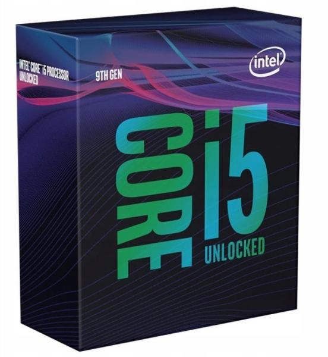

# OpenCore Configuration for Gigabyte H370M DS3H

Current OpenCore version: 0.5.6

## Hardware

<table>
<tr><td align="center"></td><td><a href="https://www.amazon.com/gp/product/B07BQ9XQPP/ref=as_li_tl?ie=UTF8&camp=1789&creative=9325&creativeASIN=B07BQ9XQPP&linkCode=as2&tag=dimitarnestor-20&linkId=fda60d461497c88f966a26137bf60e37">Gigabyte H370M DS3H (LGA1151/Intel/H370/Micro ATX/DDR4)</a></td></tr>
<tr><td align="center"></td><td><a href="https://www.amazon.com/gp/product/B07HHLX1R8/ref=as_li_tl?ie=UTF8&camp=1789&creative=9325&creativeASIN=B07HHLX1R8&linkCode=as2&tag=dimitarnestor-20&linkId=0222d5d098a4ee90dbe02065ea7876bb">Intel® Core™ i5-9600K Hexa-Core 3.7GHz (4.6 GHz Turbo) LGA1151</td></tr>
<tr><td align="center"></td><td>Intel® UHD Graphics 630</td></tr>
<tr><td align="center"></td><td><a href="https://www.amazon.com/gp/product/B00FW4A5YU/ref=as_li_tl?ie=UTF8&camp=1789&creative=9325&creativeASIN=B00FW4A5YU&linkCode=as2&tag=dimitarnestor-20&linkId=4d4a34e185b0d2bb1f6908997be4b3a4">ASUS Radeon R9 270X DirectCU II TOP 2 GB GDDR5</td></tr>
<tr><td align="center"></td><td><a href="https://www.amazon.com/gp/product/B07KZNTZYB/ref=as_li_tl?ie=UTF8&camp=1789&creative=9325&creativeASIN=B07KZNTZYB&linkCode=as2&tag=dimitarnestor-20&linkId=39a6127a143bc7c652d2638d8bc3bfa4">XPG GAMMIX S11 Pro PCIe Gen3x4 M.2 2280</td></tr>
</table>

## About This Mac

## BIOS Settings

## System Information

